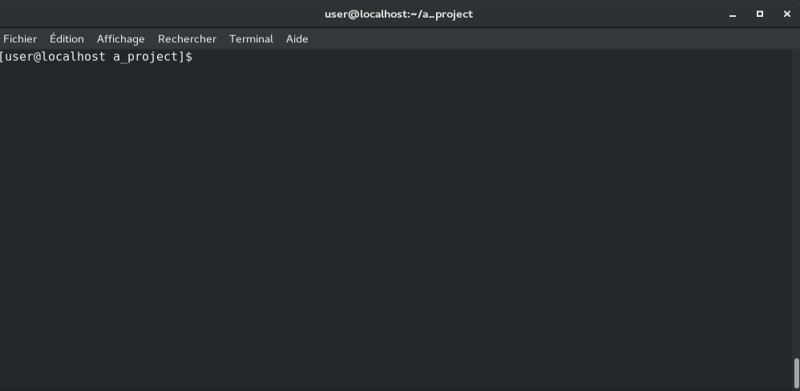

# django-settings-custom
[](https://opensource.org/licenses/MIT)
[](https://travis-ci.org/ThomasMarques/django-settings-custom)
[](https://coveralls.io/github/ThomasMarques/django-settings-custom)
[](https://pypi.org/project/django-settings-custom)
[](https://pypi.org/project/django-settings-custom)
[](https://pypi.org/project/django-settings-custom)
[](https://django-settings-custom.readthedocs.io/en/latest/?badge=latest)

A Django interactive command for configuration file generation.

## Getting It

The project is on PyPI (https://pypi.org/project/django-settings-custom/)

```
pip install django-settings-custom
```

## Installing It

To enable `django_settings_custom` in your project you need to add it to `INSTALLED_APPS` in your projects
`settings.py` file:
```
INSTALLED_APPS = (
    ...
    'django_settings_custom',
    ...
)
```

## Using It

Create a template for your target conf.ini like
```ini
[DATABASE]
NAME = { USER_VALUE }
HOST = { USER_VALUE }
PORT = { USER_VALUE }

[DATABASE_CREDENTIALS]
USER = { USER_VALUE }
PASSWORD = { ENCRYPTED_USER_VALUE }

[DJANGO]
KEY = { DJANGO_SECRET_KEY }

# A constant field
[LDAP]
URL = 'ldaps://myldap'
```

### Configure in Django settings
Add `settings.py` file
```python
SETTINGS_TEMPLATE_FILE = 'PATH_TO_YOUR_TEMPLATE_CONFIGURATION_FILE'
SETTINGS_FILE_PATH = 'TARGET_FOR_CONFIGURATION_FILE'
```

Launch in command line
```
python manage.py generate_settings
```

### Or all in command line
```
python manage.py generate_settings path/to/template/settings.ini target/path/of/settings.ini
```


## Results


The command ask user to fill missing values from template:
```
[user@localhost a_project]$ ./manage.py generate_conf
** Configuration file generation: **

** Configuration file generation: **
Do you want to generate the secret key for Django ? (Y/n) : y
Django secret key generated

** Enter values for configuration file content **

Value for [DATABASE] NAME: database_name
Value for [DATABASE] HOST: database_host
Value for [DATABASE] PORT: 900
Value for [DATABASE_CREDENTIALS] USER: my_user
Value for [DATABASE_CREDENTIALS] PASSWORD (will be encrypted):

Writing file at /home/user/a_project/conf.ini:
Configuration file successfully generated.
[user@localhost a_project]$ 
```

It generates the file /home/user/a_project/conf.ini:
```ini
[DATABASE]
NAME = database_name
HOST = database_host
PORT = 900

[DATABASE_CREDENTIALS]
USER = my_user
PASSWORD = JbAwLj5Zwz8lMrvcUZq5sP/v6eaUFY5E7U8Fmg63vxI=

# A constant field
[LDAP]
URL = 'ldaps://monldap'

[DJANGO]
KEY = w)r13ne4=id9_8xdojir)3)%%5m3r$co#jwj_)4d*_%%!0+f#sro
```

And to decrypt values in your code (in settings.py for example), you may use `django_settings_custom.encryption.decrypt` :
```python
import configparser
from django_settings_custom import encryption

config = configparser.RawConfigParser()
config.read(SETTINGS_FILE_PATH)
database_password = encryption.decrypt(config.get('DATABASE_CREDENTIALS', 'PASSWORD'))
```
To decrypt values, the function uses the django SECRET_KEY (must be set before).

## Miscellaneous

### If you don't want to use Django settings
If you don't want to add specific variables to your Django settings file, you can inherit `generate_settings.Command` to specify command options :
```python
from django_settings_custom.management.commands import generate_settings


class Command(generate_settings.Command):
    settings_template_file = 'The/settings/template/file_path.ini'
    settings_file_path = 'The/target/settings/file_path.ini'
```

### Adding custom tag
To add a custom tag, you can inherit `generate_settings.Command` and override the method `get_value` :

```python
import random
from django_settings_custom.management.commands import generate_settings


class Command(generate_settings.Command):

    def get_value(self, section, key, value_type):
        if value_type == 'RANDOM_VALUE':
            return random.uniform(0, 100)
        return super(Command, self).get_value(section, key, value_type)
```

Or a little more complex example :

```python
from django.core.management.base import CommandError
from django_settings_custom.management.commands import generate_settings


class Command(generate_settings.Command):

    def get_value(self, section, key, value_type):
        int_less_10 = value_type == 'INT_LESS_THAN_10'
        if int_less_10:
            value_type = 'USER_VALUE'
        value = super(Command, self).get_value(section, key, value_type)
        if int_less_10:
            try:
                value = int(value)
                if value >= 10:
                    raise CommandError('This field needs an int less than 10.')
            except ValueError:
                raise CommandError('This field needs an int.')
        return value
```

## [Documentation](https://django-settings-custom.readthedocs.io/en/latest/?badge=latest)

